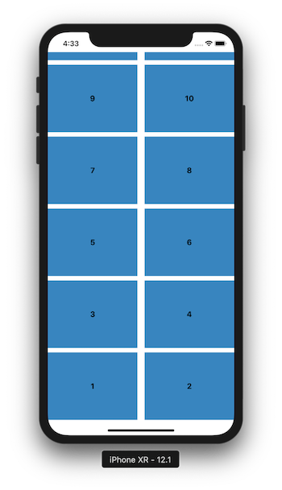

# ARInvertedFlowLayout

This is a basic basic way to invert collectionView upside down.


## Platform

- Xcode 10.1
- Swift 4.2

## Usage 

1.  Add `InvertedFlowLayout.swift` into you project.
2.  Change `CollectionView Flow layout` from `Flow` to `Custom` and set it to `InvertedFlowLayout`


3.  In `viewDidLoad` transform ColloectionView like below.

```swift
collectionView?.transform = CGAffineTransform(scaleX: 1, y: -1)
```
Hope this helps.
## Author

AbdulRehman  Warraich, ar.warraich@outlook.com


